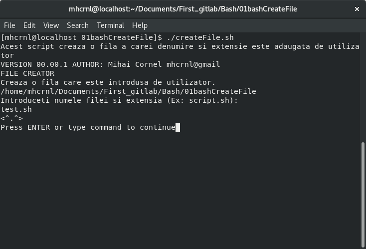

## BASH FILE CREATOR

#### Creaza o fila noua in directorul curent, aceasta are denumirea introdusa de utilizator.

### Instalare si rulare
```bash
$ git clone https://github.com/mhcrnl/01bashCreateFile.git
$ cd 01bashCreateFile
$ ./createFile.sh
```



### Fila gitpush.sh 
```
#!/bin/bash

DATE=`date`

git add .
git commit -m "$DATE"
git push origin master
```
Actualizeaza codul de pe github.